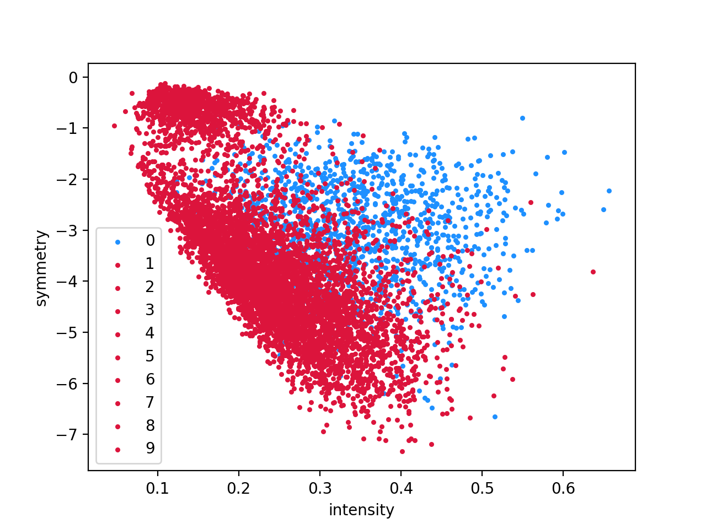
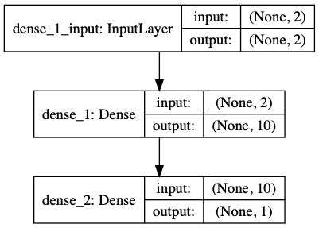

#REPORT for HOMEWORK4
                        Jianyunwu 56097064
# Problem1
## Pictures
### all

### for every label

## analysis
From the plot we can tell these data are croweded under 2 dimensions of intensity and symmetry. With these two features, only 0 and 1 can be divided from others better.

# Problem2
## model structure
activition function: sigmoid
optimizier: SGD
model1:[2,10,1]
model2:[2,6,1]
model3:[2,3,1]

use model3 as example:

the structure program draw :
model1

model2

model3

## compare

### *in-sample err*

fold | model1 | model2 | model3 
:-: | :-: | :-: | :-: 
1 | 0.10424975546506735 | 0.13486736027094035 | 0.31666794556837813 
2 | 0.11964598716049671| 0.129807025552025 | 0.35231537946592034
3 |0.13435564638901856| 0.14421843574896784 | 0.22817056807157057
mean | 0.11941712967152755| 0.1362976071906444 | 0.2990512977019563

### *test-set err*

fold | model1 | model2 | model3 
:-: | :-: | :-: | :-: 
1 | 0.1081075934181973 |0.13911615114752024 | 0.32053642166553215 
2 |0.11976621609467726| 0.12982253707372227 | 0.3516518171016987 
3 | 0.12993708321681388|0.14026892552008996 | 0.22385613368107724
mean | 0.11927029757656282 | 0.1364025379137775|0.29868145748276936  

## analysis
From the table above, we can tell model1's performance is the best, and model3 is the worest.
Maybe we can say with enough training, with larger number of units, model performs better.

# Problem3
## model compare
model1:[256,6,2,1]
model2:[256,3,2,1]
### model structure
model1:

model2:

### *in-sample err*

fold | model1 | model2 
:-: | :-: | :-: 
1 | 0.034394051850988316 | 0.2286447992691627  
2 | 0.001363789220765505| 0.03837108826774685
3 |0.04159947733800075| 0.035572247763990095 
mean |0.025785772803251523|0.10086271176696654

### *test-set err*

fold | model1 | model2 
:-: | :-: | :-: 
1 |0.041843194743321634|0.23042585716480943|
2 |0.005192505216333442|0.039086641342594076  
3 |0.04771237906355124|0.0376400548678178
mean |0.03158269300773544|0.1023841844584071 

## plot change of in-sample err and test-set error for each iteration

## analysis
* From the table we could tell:
    1. For same iteration, with more layer, the model will performs better.
    2. With more units, the model performs better.
* From the line chart, we know:
    3. There is a number(for this task is about 50), before that number of iteration, Ein and Eval both decrease. But after that number of iteration, Eval increase while Ein decrease.

# Probelm4

## model structure
* algorithm: Convolutional Neural Network
* model structure'layer(activation)':
[Conv(relu),Conv(relu),MaxPooling,Dropout,Flatten,Dense(relu),Dropout,Dense(softmax)]
* model units for each layer:[(16,16,1),(14,14,32),(12,12,64),(6,6,64),(2304),(32),(32),(10)]

## 3-fold validation
accuracy:

fold | 1 | 2 | 3 | var |
:-: | :-: | :-: | :-: | :-: |
in-sample accuracy |0.9981470108032227|0.9973256587982178|0.9977384805679321|1.1243754253579634e-07
test-set accuracy |0.9880854487419128|0.9769547581672668|0.9806345105171204|2.1438814494937713e-05

# Conclusion
    1. For same iteration, with more layer, the model will performs better.
    2. With more units, the model performs better.
    3. There is a number(for this task is about 50), before that number of iteration, Ein and Eval both decrease. But after that number of iteration, Eval increase while Ein decrease.
    4. Neural network is effective for digit classification.

